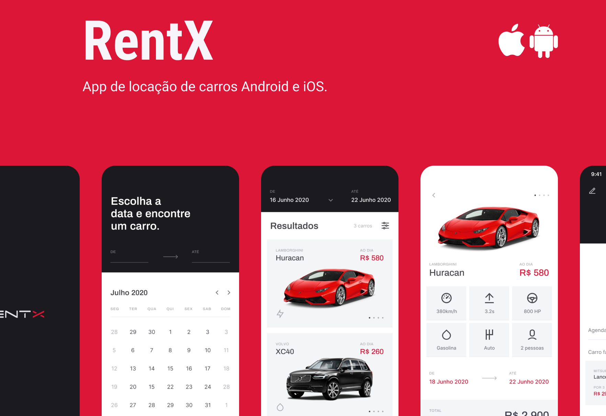

# Rentx

Rentx é um aplicativo de aluguel de carros, desenvolvido durante o Ignite da Rocketseat.

## Stack

- React Native
- Typescript
- Expo Bare Workflow
- WatermelonDB
- Lottie
- Reanimated v2
- Cache Image
- Offline first
- Nodejs as backend

## Instalação

```bash
# Clone o repositório
git clone https://github.com/andre-ols/rentx-mobile.git

# Entre na pasta do projeto
cd rentx-mobile

# Instale as dependências
yarn install
```

## Iniciando a aplicação

Lembre-se de atualizar a baseURL em services/api.ts com o endereço IP da sua máquina para utilizar o back-end.

Em seguida execute a API:

```bash
yarn start
```

## Funcionalidades

- Autenticação de usuário
- Cadastro de usuário
- Atualização de perfil
- Listagem de carros disponíveis
- Listagem de meus carros alugados
- Aluguel de carros
- E mais...

## Demo

Clique no link para visualizar o vídeo no LinkdeIn:

[](https://www.linkedin.com/posts/andre-ols_react-native-reactnative-activity-6989942847319740416-XeT7?utm_source=share&utm_medium=member_desktop)
